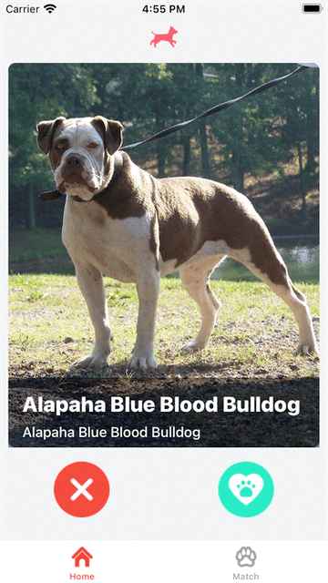

## Happ-Dog

Happ-dog  é um aplicativo criado para fins de estudo utilizando a arquitetura VIP. O app utilizou a API TheDogApi para obter os dados e imagens.
    Para auxiliar no desenvolvimento foi utilizado bibliotecas como Koloda e Alamofire.

 

 
    

        

           <b>Home</b>
             
            
        

         
        

           <b>Tela de Detalhes</b>
             
           
        
 
         
        

           <b>Tela de Likes e Dislikes</b>
             
           
        
 
    

